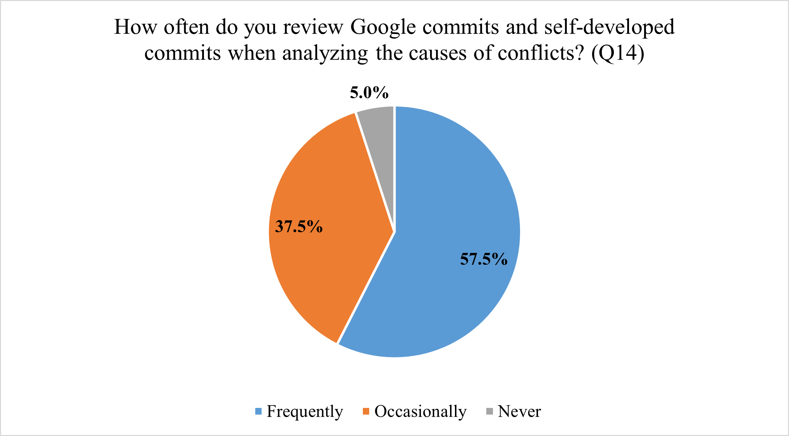
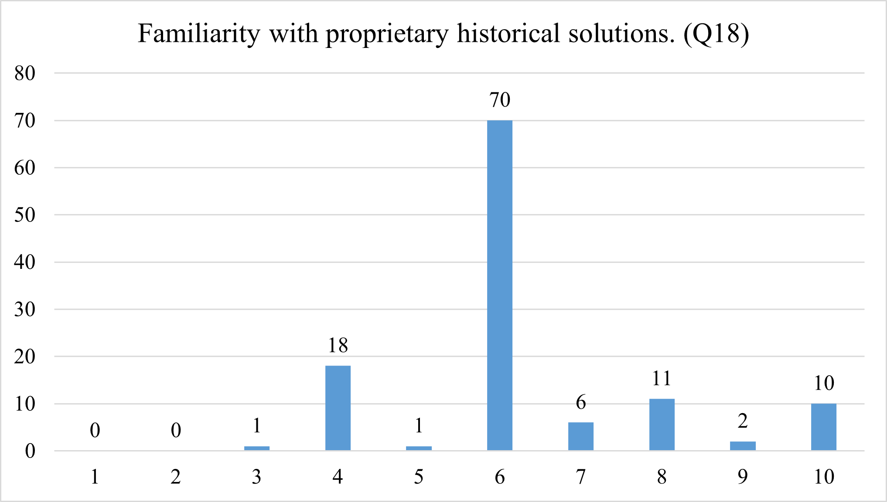
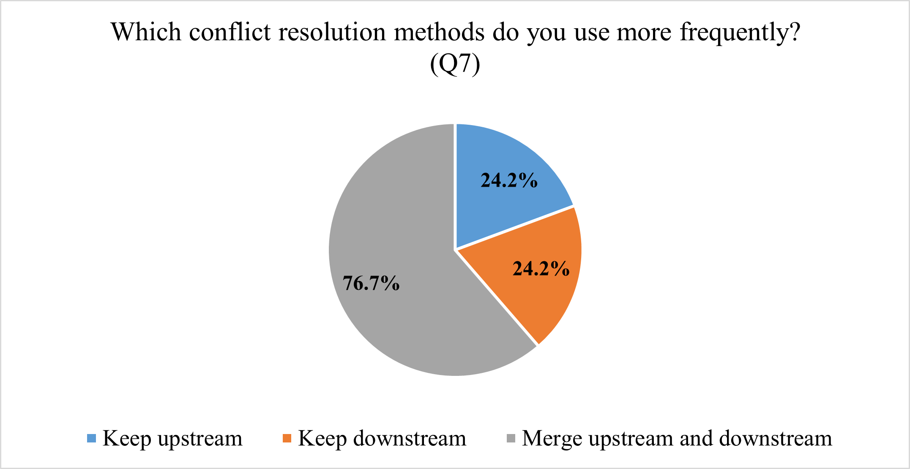
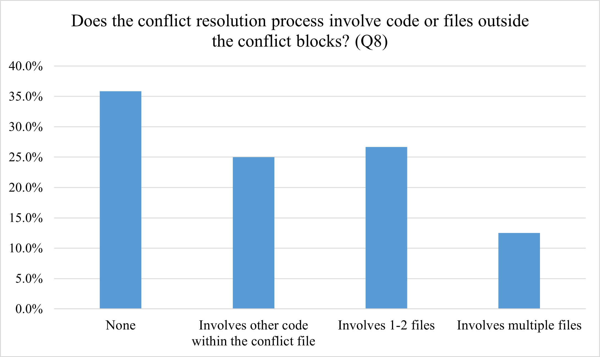

# Supplement F Statistical Data

1. In **O3.2**, our survey shows that **57.5%** of developers frequently review the historical commit records of conflicting code to understand the changes.   The statistical data is as follows.

   

2. In **O3.2**, we surveyed 120 participants to gauge their familiarity with AOSP and downstream changes using a scale from 1 to 10. Results show that **60.9%** have a basic understanding (score = 6), with only **15.5%** feeling confident in both upstream and downstream commits (score > 6). The statistical data is as follows. The horizontal axis represents familiarity level (scale of 1 to 10), and the vertical axis represents the number of people.

​		

3. In **O3.3**, our survey indicates that out of the 120 practitioners surveyed, **92 (76.7%)** of them frequently engage in “partial merging” of upstream and downstream changes to resolve conflicts.  The statistical data is as follows. 

4. In **O4.1**, our survey shows that **64.2%** of participants stated that they often look beyond conflict blocks to solve conflicts; **12.5%** of them experienced conflicts affecting more than two files.  The statistical data is as follows. 

